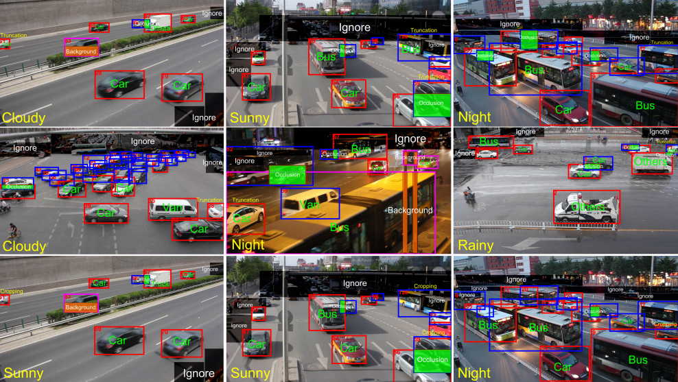
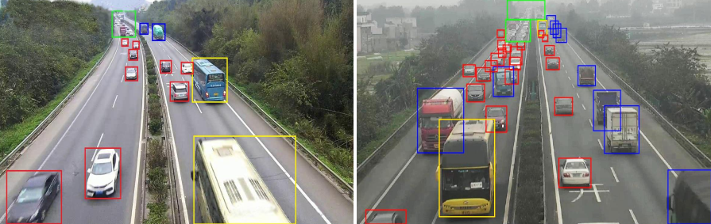

# data_clean2voc
The repository consists of some scripts that can clean the annotations to xml files

---
#### For DETRAC dataset
```
You can download it by using the following URL.
```
https://detrac-db.rit.albany.edu/download
For example

---
#### Clean step
##### Firstly read the information in the original xml file
```
run DTxml_Parser.py
```
##### Secondly according to the generated vocxml, migrate the corresponding image to the target directory
```
run Data_migrator.py
```
##### Thirdly generate related ImageSets files
```
run ImageSets_builder.py
```
---
#### For LSVH dataset
```
You can download it by using the following URL.
[LSVH dataset](https://drive.google.com/open?id=1yHeuZia3pbcbn8OLkotJGJGhczI7gM3e).
For example

```
---
#### Clean step
```
just run lsvh2pascalvoc.py
```
